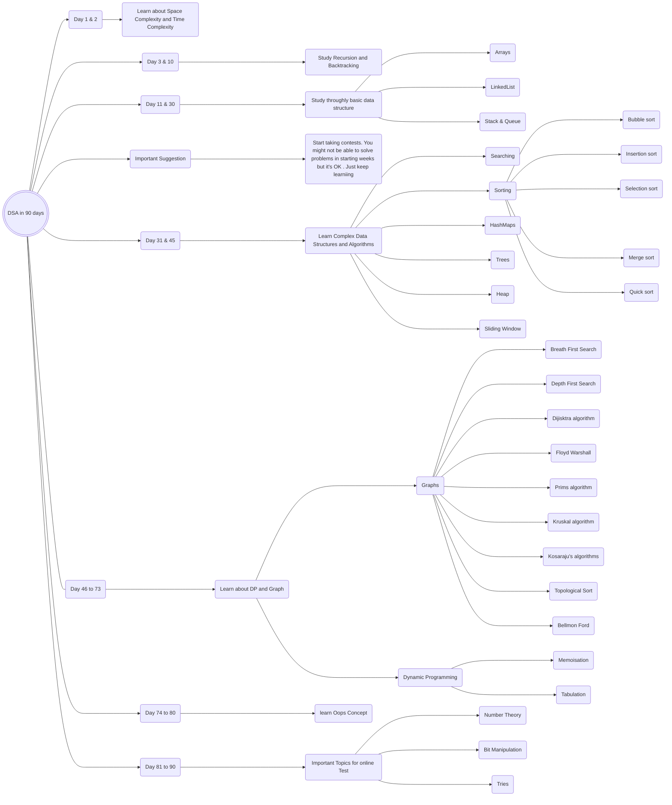

# DSA-roadmap-in-90-day

Note : Remember this , "Consistency is what transfers average into Excellence". 

----------------
## Roadmap

```mermaid
flowchart LR
    A(((DSA in 90 days))) --> B(Day 1 & 2)
    B --> BA(Learn about Space Complexity and Time Complexity)
    
    A ---> C(Day 3 & 10)
    C ---> CA(Study Recursion and Backtracking)
    
    A ---> D(Day 11 & 30)
    D ---> DA(Study throughly basic data structure)
    DA ---> DAA(Arrays)
    DA ---> DAB(LinkedList)
    DA ---> DAC(Stack & Queue)
    
    A ---> E(Important Suggestion)
    E ---> EA(Start taking contests. You might not be able to solve problems in starting weeks but it's OK . Just keep learniing)
    
    
    A ---> F(Day 31 & 45)
    F ---> FA(Learn Complex Data Structures and Algorithms)
    FA ---> FAA(Searching)
    FA ---> FAB(Sorting)
    FAB ---> FABA(Bubble sort)
    FAB ---> FABB(Insertion sort)
    FAB ---> FABC(Selection sort)
    FAB ---> FABD(Merge sort)
    FAB ---> FABE(Quick sort)
    FA ---> FAC(HashMaps)
    FA ---> FAD(Trees)
    FA ---> FAE(Heap)
    FA ---> FAF(Sliding Window)
    
    A --- G(Day 46 to 73)
    G ---> GA(Learn about DP and Graph)
    GA ---> GAA(Graphs)
    GAA ---> GAAA(Breath First Search)
    GAA ---> GAAB(Depth First Search)
    GAA ---> GAAC(Dijisktra algorithm)
    GAA ---> GAAD(Floyd Warshall)
    GAA ---> GAAE(Prims algorithm)
    GAA ---> GAAF(Kruskal algorithm)
    GAA ---> GAAG(Kosaraju's algorithms)
    GAA ---> GAAH(Topological Sort)
    GAA ---> GAAI(Bellmon Ford)
    GA ---> GAB(Dynamic Programming)
    GAB ---> GABA(Memoisation)
    GAB ---> GABB(Tabulation)
    
    
    A ---> H(Day 74 to 80)
    H ---> HA(learn Oops Concept)
    
    
    A ---> I(Day 81 to 90)
    I ---> IA(Important Topics for online Test)
    IA ---> IAA(Number Theory)
    IA ---> IAB(Bit Manipulation)
    IA ---> IAC(Tries)
 
```
