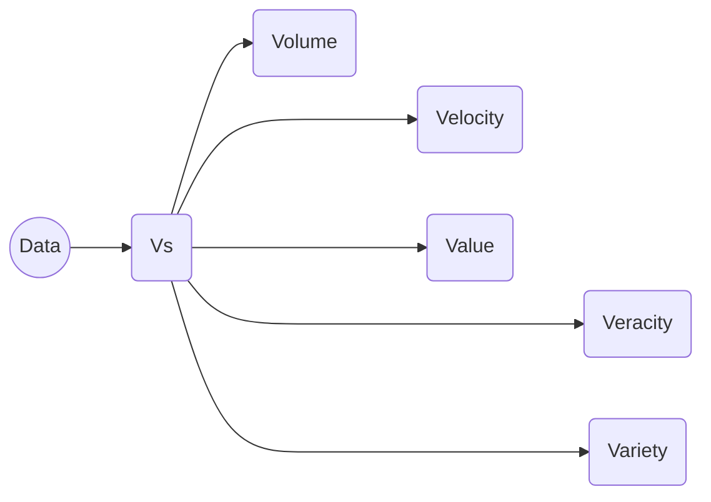
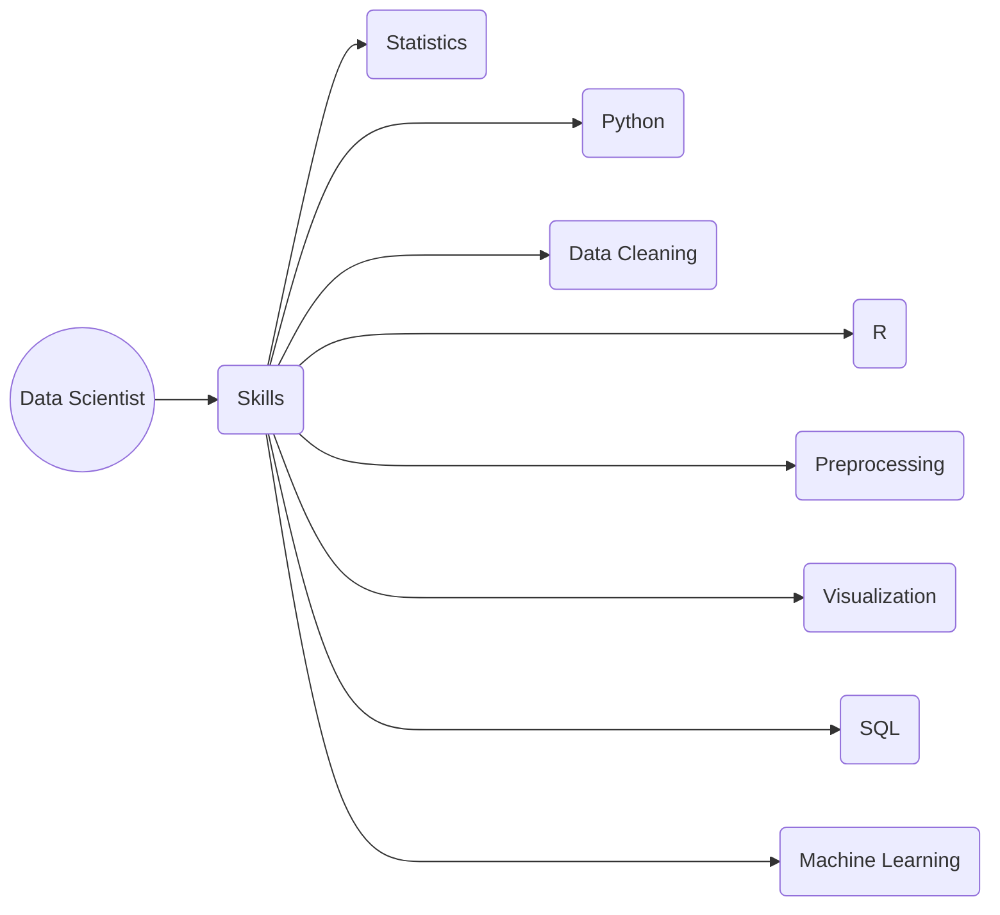
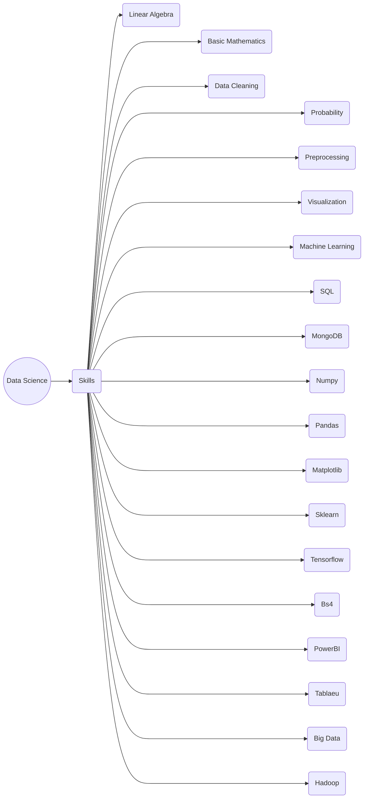

# What is Data Science

- Data Science is a process, not an event. It is the process where we use data to generalize the useful insights.
- And the overall process is done by professionals like data analysts and data scientists.
- From the data, you must be able to ask questions and be prepared to answer it. Suppose, there is a lot of data from the Census.
- So, think what could be the possible questions? You may think, how many people are married, or have children? Which age group of people are in foreign? What is the literacy rate?

## What is data?

- These are the facts, values, figures, texts, audio, videos which get generated by ourselves in day-to-day life.
- These are generated from our smartphones, photos, videos and texts. In the beginning, they are not being analyzed or utilized for solving business problems.
Hours of videos are being uploaded in YouTube every second, thousands of Facebook users are posting something every minute etc.
Information: The meaningful insights that come from data after proper analysis of it is information.

## RoadMap | Data Scientist

- Data Scientist are those skilled person who solves real world problem using the data. These are the genius who collect the data, analyze the data, manipulate the data, visualize the data and extracts useful information from the data. These are the skills the data scientist must have.

### Data Science Beginners roadmap

## Resources

- [Python](https://www.geeksforgeeks.org/python-programming-language/)

- [Numpy](https://numpy.org/doc/)
- [Pandas](https://www.geeksforgeeks.org/pandas-tutorial/)
- [Matplotlib](https://www.geeksforgeeks.org/matplotlib-tutorial/)
- [Seaborn](https://seaborn.pydata.org/)
- [Sklearn](https://www.geeksforgeeks.org/learning-model-building-scikit-learn-python-machine-learning-library/)
- [Tensorflow](https://www.tensorflow.org/tutorials)
- [Machine-Learning](https://www.coursera.org/learn/machine-learning?utm_source=gg&utm_medium=sem&utm_campaign=B2C_INDIA__branded_FTCOF__arte&utm_content=B2C&campaignid=18216928764&adgroupid=141296025792&device=c&keyword=coursera%20machine%20learning%20course&matchtype=b&network=g&devicemodel=&adpostion=&creativeid=619458216884&hide_mobile_promo)
- [Deep-Learning](https://www.coursera.org/specializations/deep-learning)
- [SQL](https://www.w3schools.com/sql/)
- [MongoDB](https://www.geeksforgeeks.org/mongodb-tutorial/)
- [Flask](https://flask.palletsprojects.com/en/2.2.x/)
