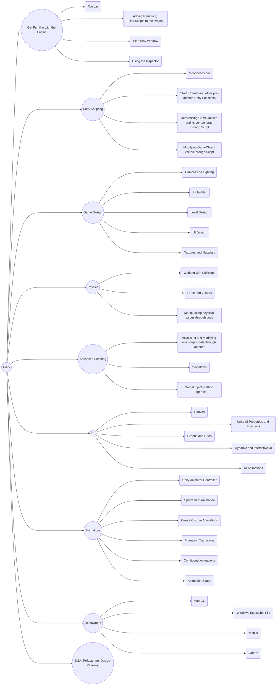

# Unity Roadmap
## Skill Beforehand
## 👉Programming
    - Basic Understanding of Programming Concepts
    - Good Understanding of C# and Object Oriented Programming
## 👉Other
    - Understanding of Basic Physics(vectors, rigidbodies etc)
    - Version Control(Not compulsary but highly recommended)

## Roadmap

