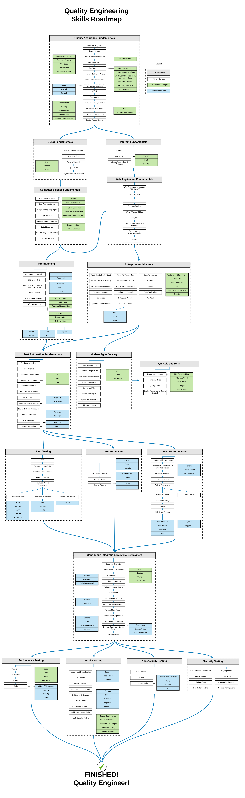

# QA Roadmap

## QA roles and Responsibilities

The main role of QA is quality assurance. A QA engineer focuses on improving software development processes and preventing defects in production. In other words, they make sure the software development team is doing the right things the right way. The QA engineer job scope embraces a number of duties

Here is a list of typical tasks of the QA specialists:

- Checking if the product complies with the requirements
- Assessing risks
- Planning ideas to improve product quality
- Planning tests
- Analyzing the test results

The QA specialization comprises many functions so there are certain sub-specializations such as quality control, software testing, and others. Let’s describe the particularities of these sub directions of QA.

The main goal of QA engineers is to prevent defects. Quality Control specialists, in their turn, analyze the test results and find mistakes. They are responsible for identifying and eliminating defects in a product (or, in other words, these engineers make sure that developers get the results they expect).

One more subspecialized direction in QA is software testing. A software tester is the one who checks the finished product for errors (bugs) and if it complies with the requirements. Also, the tester documents defects and the ways of fixing them.

## The main QA roles

QA specialists can also execute different roles within certain projects. There are four main QA roles: Test Analyst, Test Designer, Test Executor, and Test Manager.

- Test Analyst is engaged in static testing of requirements and checks them for completeness and consistency.
- Test Designer creates a set of tests based on requirements and plans configurations that are necessary for testing.
- Test Executor performs pre-planned tests, describes and documents the found errors, and steps for reproducing (or fixing) them.
- Test Manager plans and monitors work related to testing such as keeping to deadlines, following a schedule, controlling requirements to tests, setting tasks for team members, and communicating with stakeholders.

