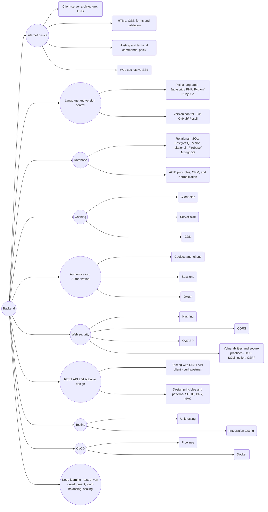

# Backend Roadmap

```mermaid
flowchart LR
    A((Backend)) --> B((Internet basics))
    B --> BA(Client-server architecture, DNS)
    B ---> BB(HTML, CSS, forms and validation)
    B ---> BC(Hosting and terminal commands, posix)
    B ---> BD(Web sockets vs SSE)

    A ---> C((Language and version control))
    C ---> CA(Pick a language - Javascript/ PHP/ Python/ Ruby/ Go)
    C ---> CB(Version control - Git/ GitHub/ Fossil)

    A ---> D((Database))
    D ---> DA(Relational - SQL/ PostgreSQL & Non-relational - Firebase/ MongoDB)
    D ---> DB(ACID principles, ORM, and normalization)

    A ---> E((Caching))
    E ---> EA(Client-side)
    E ---> EB(Server-side)
    E ---> EC(CDN)

    A ---> F((Authentication, Authorization))
    F ---> FA(Cookies and tokens)
    F ---> FB(Sessions)
    F ---> FC(OAuth)

    A ---> G((Web security))               
    G ---> GA(Hashing)
    G ----> GB(CORS)
    G ---> GC(OWASP)
    G ----> GD(Vulnerabilities and secure practices - XSS, SQLinjection, CSRF)

    A ---> H((REST API and scalable design))
    H ---> HB(Testing with REST API client - curl, postman)
    H ---> HA(Design principles and patterns- SOLID, DRY, MVC)    
    
    A ---> I((Testing))
    I ---> IA(Unit testing)
    I ----> IB(Integration testing)

    A ---> J((CI/CD))
    J ---> JA(Pipelines)
    J ----> JB(Docker)

    A ---> K((Keep learning - test-driven development, load-balancing, scaling))

```
