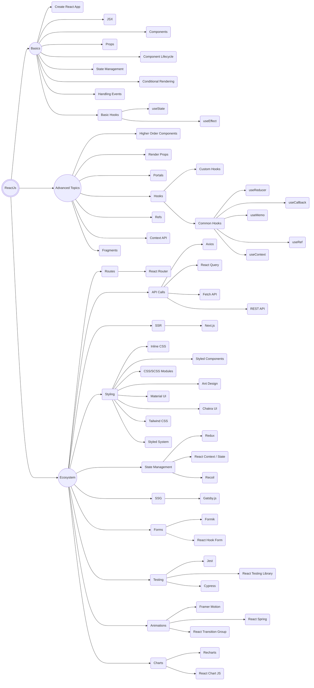

# ReactJs Roadmap

----------------

## Requirements

- Basic knowledge of HTML, CSS
- Basic knowledge of Javascript, ES6 and above
  - Arrow functions
  - Destructuring
  - Spread operator
  - .map(), .filter(), .reduce(), .forEach() etc
  - Browser Events
- Fundamentals 
  - Create React App
  - JSX
  - Components
    - Functional Components
    - Class Components
  - Props vs State
  - Conditional Rendering
  - Component Life Cycle
  - Lists and Keys
  - Composition vs Inheritance
  - Basic Hooks
    - `useState` and `useEffect`
- Advanced Topics
  - More Advance Hooks
    - useMemo
    - useReducer
    - useContext
    - useCallback
    - useRef
  - Custom Hooks
  - Context
  - Refs
  - Render Props
  - Routing 
  - SSR, SSG
  - Redux

**You can learn these from [Javascript Roadmap](/Javascript/Readme.md)**

----------------

## Roadmap

