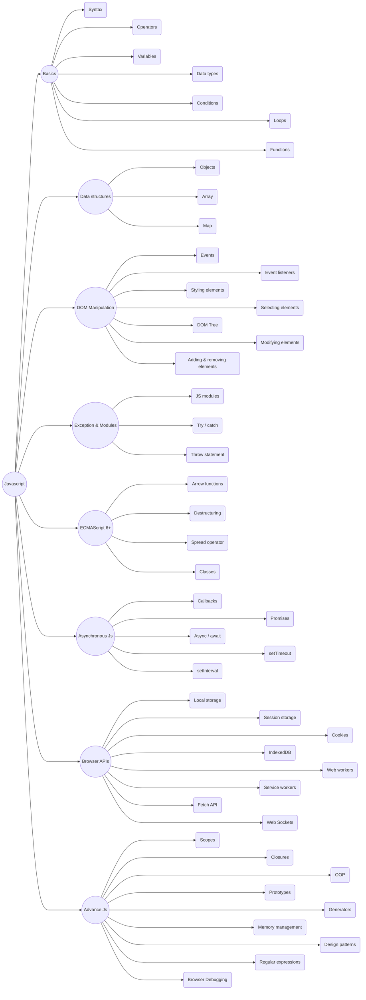

# Javascript Roadmap

```mermaid
flowchart LR
    A((Javascript)) --> B((Basics))
    B --> BA(Syntax)
    B ---> BB(Operators)
    B ---> BC(Variables)
    B ----> BD(Data types)
    B ----> BE(Conditions)
    B -----> BF(Loops)
    B -----> BG(Functions)

    A ---> C((Data structures))
    C ---> CK(Objects)
    C ---> CL(Array)
    C ---> CM(Map)

    A ---> D((DOM Manipulation))
    D ---> DA(Events)
    D ----> DB(Event listeners)
    D ---> DC(Styling elements)
    D ----> DD(Selecting elements)
    D ---> DE(DOM Tree)
    D ----> DF(Modifying elements)
    D ---> DG(Adding & removing elements)

    A ---> E((Exception & Modules))
    E ---> EA(JS modules)
    E ---> EB(Try / catch)
    E ---> EC(Throw statement)

    A ---> F((ECMAScript 6+))
    F ---> FB(Arrow functions)
    F ---> FA(Destructuring)
    F ---> FC(Spread operator)
    F ---> FD(Classes)

    A ---> G((Asynchronous Js))               
    G ---> GA(Callbacks)
    G ----> GB(Promises)
    G ---> GC(Async / await)
    G ----> GD(setTimeout)
    G ---> GE(setInterval)

    A ---> H((Browser APIs))
    H ---> HA(Local storage)
    H ----> HB(Session storage)
    H -----> HC(Cookies)
    H ----> HD(IndexedDB)
    H -----> HE(Web workers)
    H ----> HF(Service workers)
    H ---> HG(Fetch API)
    H ----> HH(Web Sockets)
    
    A ---> I((Advance Js))
    I ---> IA(Scopes)
    I ----> IB(Closures)
    I -----> IC(OOP)
    I ----> ID(Prototypes)
    I -----> IE(Generators)
    I ----> IF(Memory management)
    I -----> IG(Design patterns)
    I ----> IH(Regular expressions)
    I ---> II(Browser Debugging)
```
